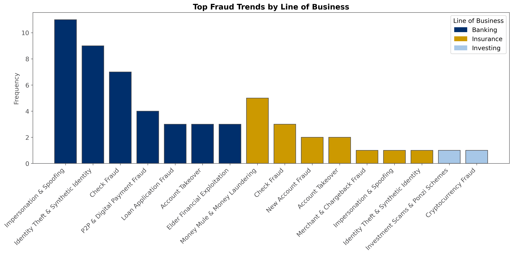
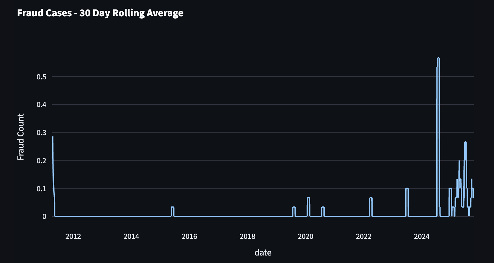
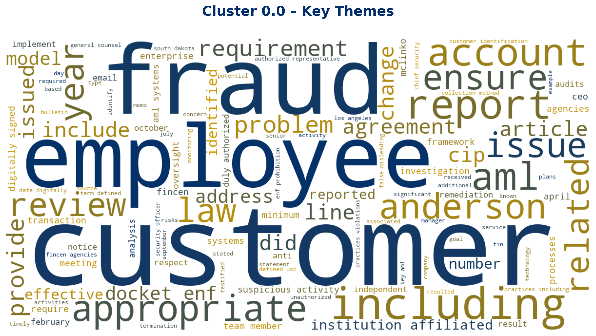
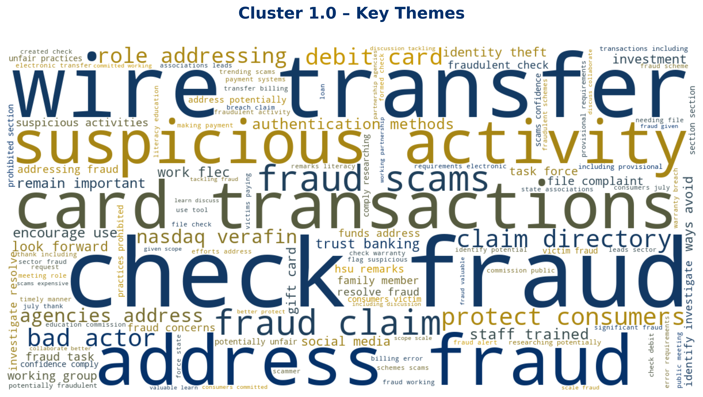

# OCC Fraud Trend Analysis Pipeline
### From OCC publications to actionable fraud intelligence
Automatically extracts, cleans, and analyzes OCC regulatory publications to uncover emerging fraud trends using NLP, embeddings, and LLMs.

**Authors:**
Wendy Ceja-Huerta, Nirvan Jaffari, Carolina Rangel Lara & Hannah Wilson

## Table of contents
- [Data Source](#data-source)
- [Quick Start](#quick-start)
- [Application Design](#application-design)
- [Process](#process)
- [Results](#results)

## Data Source
The Office of the Comptroller of the Currency (OCC) is the primary federal regulator for national banks and federal savings associations in the United States. Through its public bulletins, press releases, and guidance documents, the OCC provides detailed insights into regulatory actions, emerging risks, and best practices across the banking sector. These publications are an invaluable resource for understanding patterns of fraud, misconduct, and financial risk within financial institutions.

## Quick Start
**File Setup**

Create a CSV file containing the type of website and the link. 

CSV file format:
```
type,website
website,www.source.com/article1.html
pdf,www.source.com/article2.pdf
```
**Google API Key Setup**

[Google API Console](https://ai.google.dev/gemini-api/docs/api-key)
1. Go to the API Console.
2. From the projects list, select a project or create a new one.
3. If the APIs & services page isn't already open, open the left side menu and select APIs & services.
4. On the left, choose Credentials.
5. Click Create credentials and then select API key.

**Install**
```
uv install bs4 google-genai matplotlib nltk pandas pdfplumber plotly python-dotenv requests seaborn sentence-transformers streamlit supabase wordcloud
```
**Sample Environment**
```
GOOGLE_API_KEY = "googleapikey"

SUPABASE_URL = "supabaseurl"
SUPABASE_KEY = "supabasekey"

# desired file path for JSON data created after running webscraping.py
JSON_DATA = "/User/scraped.json"

# file path for website type and link
CSV_DATA = "/User/websites.csv"

# results saved from previous identification to save cost if identify.py needs to be rerun again with new articles
CACHE_PATH = "/Users/hannahw/studio3project/fraud_results_optimized.json"
```
**Run**

Webscraper
```
uv run webscraping.py
```
Fraud Detector
```
uv run identify.py
```
Analyzer
```
uv run analysis.py
```
Dashboard
```
uv run streamlit_run.py
```
## Application Design
### Architecture Diagram


### Folder Structure
```
project/
│── 3XDashboard/
│── charts/
|    ├── wordclouds/
│── data/
│── pipelineCode/
│── pyproject.toml
│── README.md
```
### GIF Demos
Dashboard


Search Library


## Process

### Text Cleaning Summary

| Step                               | Description                                                                                                                          | Example Output                                                                                                                                           |
| ---------------------------------- | ------------------------------------------------------------------------------------------------------------------------------------ | -------------------------------------------------------------------------------------------------------------------------------------------------------- |
| 1. Raw Text                   | Unprocessed OCC website text containing headers, navigation links, and language unrelated to articles.                  | `Consumer Protection: Interagency Statement on Elder Financial Exploitation … Skip to main content … the agencies issued a statement … `             |
| 2. After `clean_text_strong()` | Removes boilerplate (“Skip to main content”), agency names, HTML, URLs, numbers, and regulatory filler. Normalizes spacing and case. | ` consumer protection elder financial exploitation issued statement provide examples identifying preventing responding elder financial exploitation ` |
| 3. After `preprocess_text()`   | Applies stopword removal, eliminates regulatory jargon, removes duplicates, keeps meaningful tokens only.                            | `elder exploitation identifying preventing responding `                                                                                              |

Scraping Code
```
def scrape_website(link):
    print(f"Scraping website: {link}")
    response = requests.get(link)
    soup = BeautifulSoup(response.text, 'html.parser')
    for script in soup(["script", "style", "nav", "footer", "header"]):
        script.extract()
    text = soup.get_text()
    date = soup.select_one('span.date')
    date = date.get_text(strip=True) if date else None
    text = text.strip()
    text = re.sub(r'\s+', ' ', text)
    return text, date
```

Text Cleaning
```
def clean_text(text):
    text = re.sub(r"\s+", " ", text)
    for phrase in junk_phrases:
        text = text.replace(phrase, "")
    return text.strip()

```
Fraud Identification
```
# 1. Embedding-based pre-screening
fraud_embeddings = model.encode(fraud_keywords)
fraud_centroid = np.mean(fraud_embeddings, axis=0).reshape(1, -1)

# Compute similarity of each document to fraud centroid
all_embeddings = np.vstack(df["embedding"])
df["fraud_score"] = cosine_similarity(all_embeddings, fraud_centroid).flatten()

# Pre-screen: high, low, or ambiguous
df.loc[df["fraud_score"] > HIGH, "fraud_related"] = True
df.loc[df["fraud_score"] < LOW, "fraud_related"] = False
df["needs_llm"] = df["fraud_related"].isna()     # only ambiguous go to LLM

def classify_gemini(text, cluster_hint):
    prompt = f"""
Determine if this article is fraud-related. Use cluster context: {cluster_hint}
Return JSON with: fraud_related, fraud_confidence, fraud_reason, summary
"""
    response = genai_client.models.generate_content(
        model="gemini-2.5-flash",
        contents=prompt,
        config={"response_mime_type": "application/json"}
    )
    return json.loads(response.text)

# Apply LLM only where needed
for i, row in df[df["needs_llm"]].iterrows():
    result = classify_gemini(row["cleaned_text"], cluster_keywords[row["kmeans_cluster"]])
    df.at[i, "fraud_related"] = result["fraud_related"]
    df.at[i, "fraud_confidence"] = result["fraud_confidence"]
    df.at[i, "fraud_reason"] = result["fraud_reason"]
    df.at[i, "summary"] = result["summary"]
```
Trend Classification
```
def assign_trend(text):
    if not isinstance(text, str):
        return "Account & Identity Attacks"

    lower = text.lower()

    # Direct pattern match
    for pattern, label in TREND_MAP:
        if re.search(pattern, lower):
            return label

    # Fall back to LLM
    return gemini_classify(text)
```

## Results
### Key Findings
- **Most Common Fraud Types**
    - Impersonation & Spoofing, Identity Theft & Synthetic Identities, and Check Fraud are the most prevalent in the banking sector, though some appear in insurance, highlighting overlaps in fraud tactics across lines of business.
- **Top Fraud Trends in Banking (Frequency)**
    - Impersonation & Spoofing
    - Identity Theft & Synthetic Identity
    - Check Fraud
    - P2P & Digital Payment Fraud
    - Loan Application Fraud
- **Focus on Identity Compromise**
    - Most banking fraud involves identity-related attacks, emphasizing the need for robust customer authentication and account security.
- **Payment Fraud Evolution**
    - Traditional payment fraud methods such as checks remain prevalent, while digital payment and P2P fraud are increasingly significant.
- **Keywords Reflect Trends**
    - Keywords like “customer identification,” “wire transfers,” “elder exploitation,” and “suspicious activity” align with fraud trends, revealing both tactics such as social engineering, fictitious addresses and operational patterns such as transaction types.
- **Fraud Surge in 2024**
    - There is a sharp increase in fraudulent activity starting in late 2024, suggesting that fraudsters are leveraging AI and automation to execute schemes more efficiently.
- **Cluster Insights**
    - Cluster 0: Payment fraud with emphasis on elder victimization, employee roles, and regulatory reporting.
    - Cluster 1: Regulatory and legal analysis for cryptocurrency and digital asset custody within national banks.
    - Cluster 2: Actionable fraud operations, highlighting instruments (wire transfers, checks, cards), detection triggers (suspicious activity), and underlying deception (identity/address fraud, scams).

### Why This Matters
- Military members face higher rates of several scams such as imposter scams or identity theft (≈45% vs 30% for non-military).
- Fraud involving synthetic identities overlaps with check fraud, putting both members and institutions such as USAA at risk.
- Military elder members are targeted for high-value scams; early detection is crucial to minimize losses.
- Understanding whether members willingly provide information (authorized) or are deceived (unauthorized) informs risk mitigation and member protection.
- Targeted scams, especially via digital payments or social engineering, are increasingly sophisticated; military accounts may be high-value targets.


### Visualizations
Fraud Trends By Line of Business


Top Fraud Related Keywords


30 Day Rolling Average of Fraud Cases


Word Clouds for KMeans Clusters



